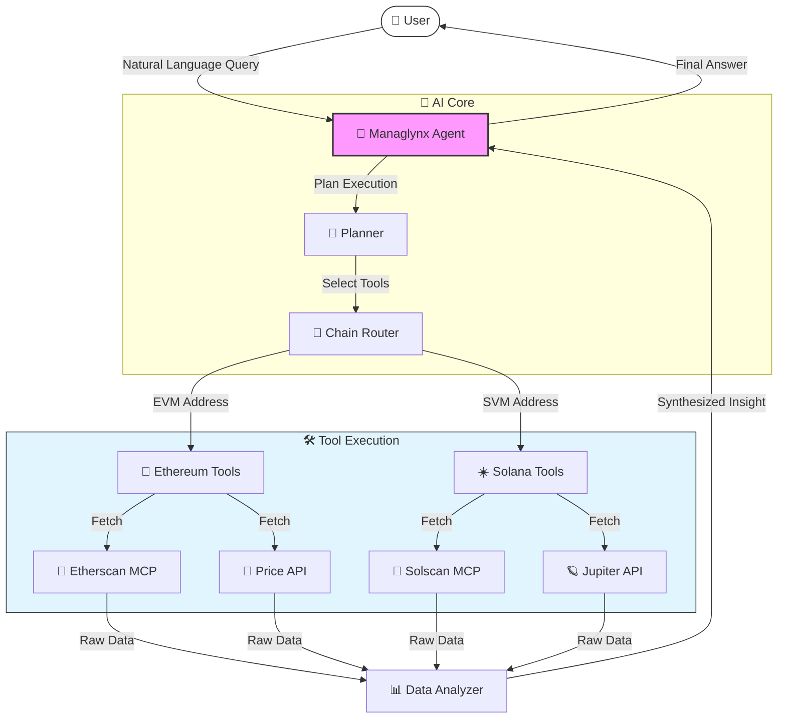

<div align="center">

# 🦁 Managlynx Agent
### The Multi-Chain AI Portfolio Manager

[](https://www.python.org/downloads/)
[](https://github.com/omnirexflora-labs/omnicoreagent)
[](https://opensource.org/licenses/MIT)

*Talk to your Ethereum & Solana wallets with AI. No complex dashboards. Just answers.*

[Features](#-features) • [How it Works](#-how-it-works) • [Quick Start](#-quick-start) • [Examples](#-examples)

</div>

---

## 🚀 Unlock Multi-Chain Intelligence

**Managlynx-Agent** isn't just a portfolio tracker—it's your text-based CFO for Web3. It understands **Ethereum (EVM)** and **Solana (SVM)** natively, translating complex on-chain data into clear, actionable financial insights.

### Why Managlynx?

| Feature | Description |
| :--- | :--- |
| **🗣️ Natural Language** | Ask questions like *"How much is my wallet worth?"* or *"Analyze my last week."* |
| **🌐 Multi-Chain Native** | Seamlessly switches between Ethereum and Solana based on address format. |
| **🧠 Deep Analysis** | Uses **GPT-4.1** to categorize transactions, detect risks, and explain DeFi moves. |
| **🔌 MCP Powered** | Built on the **Model Context Protocol**, connecting directly to Etherscan & Solscan. |
| **💸 Zero-Config Prices** | Integrated real-time pricing from DeFiLlama & Solscan. |

---

## 🛠 How It Works

Managlynx uses an agentic workflow to orchestrate tools across different blockchains. It "thinks" before it acts, selecting the right MCP server for the job.

![Managlynx Architecture Flow](https://mermaid.ink/img/Z3JhcGggVEQKICAgIFVzZXIoW_CfkaQgVXNlcl0pIC0tPnxOYXR1cmFsIExhbmd1YWdlIFF1ZXJ5fCBBZ2VudFvwn6aBIE1hbmFnbHlueCBBZ2VudF0KICAgIAogICAgc3ViZ3JhcGggQnJhaW4gW_Cfp6AgQUkgQ29yZV0KICAgICAgICBBZ2VudCAtLT58UGxhbiBFeGVjdXRpb258IFBsYW5uZXJb8J-TnSBQbGFubmVyXQogICAgICAgIFBsYW5uZXIgLS0-fFNlbGVjdCBUb29sc3wgUm91dGVyW_CflIAgQ2hhaW4gUm91dGVyXQogICAgZW5kCiAgICAKICAgIHN1YmdyYXBoIFRvb2xzIFvwn5ug77iPIFRvb2wgRXhlY3V0aW9uXQogICAgICAgIFJvdXRlciAtLT58RVZNIEFkZHJlc3N8IEVWTVvwn5S3IEV0aGVyZXVtIFRvb2xzXQogICAgICAgIFJvdXRlciAtLT58U1ZNIEFkZHJlc3N8IFNWTVvimIDvuI8gU29sYW5hIFRvb2xzXQogICAgICAgIAogICAgICAgIEVWTSAtLT58RmV0Y2h8IEV0aGVyc2Nhblvwn5OhIEV0aGVyc2NhbiBNQ1BdCiAgICAgICAgRVZNIC0tPnxGZXRjaHwgRGVGaUxsYW1hW_CfppkgUHJpY2UgQVBJXQogICAgICAgIAogICAgICAgIFNWTSAtLT58RmV0Y2h8IFNvbHNjYW5b8J-ToSBTb2xzY2FuIE1DUF0KICAgICAgICBTVk0gLS0-fEZldGNofCBKdXBb8J-qkCBKdXBpdGVyIEFQSV0KICAgIGVuZAogICAgCiAgICBFdGhlcnNjYW4gJiBEZUZpTGxhbWEgJiBTb2xzY2FuICYgSnVwIC0tPnxSYXcgRGF0YXwgQW5hbHl6ZXJb8J-TiiBEYXRhIEFuYWx5emVyXQogICAgQW5hbHl6ZXIgLS0-fFN5bnRoZXNpemVkIEluc2lnaHR8IEFnZW50CiAgICBBZ2VudCAtLT58RmluYWwgQW5zd2VyfCBVc2VyCiAgICAKICAgIHN0eWxlIEFnZW50IGZpbGw6I2Y5ZixzdHJva2U6IzMzMyxzdHJva2Utd2lkdGg6MnB4CiAgICBzdHlsZSBVc2VyIGZpbGw6I2ZmZixzdHJva2U6IzMzMwogICAgc3R5bGUgVG9vbHMgZmlsbDojZTFmNWZlLHN0cm9rZTojMzMzCg==)

<details>
<summary>📝 View Mermaid Source</summary>


</details>

---

## ⚡ Quick Start

### 1. Prerequisites
You need **uv** installed and the following MCP servers:
*   [Solscan MCP](https://github.com/wowinter13/solscan-mcp)
*   [EVM MCP](https://github.com/mcpdotdirect/evm-mcp-server)
*   [Etherscan MCP](https://docs.etherscan.io/mcp-docs/introduction)

### 2. Setup
```bash
# Clone and install dependencies
git clone https://github.com/your-repo/managlynx-agent.git
cd managlynx-agent
uv sync

# Configure Environment
export LLM_API_KEY=your_openai_key
# Ensure your MCP servers are configured in tools/mcp_tools.py
```

### 3. Run
```bash
uv run python main.py
```

---

## 💬 Examples

### 🔷 Ethereum Portfolio
> **You:** *"Show portfolio for 0xd8dA6BF26964aF9D7eEd9e03E53415D37aA96045"*

```text
🦁 Managlynx: This is Vitalik Buterin's address! 💡

🔷 Ethereum Portfolio Summary
💰 Total Value: $1,240,500.00

ASSETS:
• ETH: 250.00 ETH ($750,000.00)
• USDC: 450,000.00 USDC ($450,000.00)
• ...

🔍 Insight: High concentration in ETH (60%). Stablecoin ratio is healthy at 36%.
```

### ☀️ Solana Activity
> **You:** *"Check this Solana wallet: HN7cABqLq46Es1jh92dQQisAq662SmxELLLS95QywqBB"*

```text
🦁 Managlynx: ☀️ Solana Portfolio

💰 Total Value: $450.20
🔥 Top Holding: Bonk (10M BONK)

RECENT ACTIVITY:
• Swap: 1.2 SOL → USDC (Jupiter Aggregator)
• NFT Mint: Mad Lads #3920
• Transfer: 0.5 SOL sent to Exchange

⚠️ Note: High frequency of meme-coin trading detected.
```

---

## 📚 Capabilities

| Domain | What it can do |
| :--- | :--- |
| **🏦 Portfolio** | Balance checks, USD valuation, Staking positions |
| **📊 Analysis** | Transaction summarization, PnL tracking, Gas spend |
| **🔍 Investigation** | Fund source tracing, Contract safety checks |
| **📈 Market** | Token prices, Market cap, Trending tokens |

---

## 🧩 Project Structure

```text
managlynx-agent/
├── core/               # 🧠 The Agent's Brain
│   ├── agent.py        # Logic & Orchestration
│   └── system_prompt.py# The Personality
├── tools/              # 🛠️ Interaction Layer
│   ├── mcp_tools.py    # MCP Client Configuration
│   └── price_tools.py  # DeFiLlama Integration
└── utils/              # ⚙️ Helper Functions
```

---

<div align="center">

**Made with 💙 using [OmniCoreAgent](https://github.com/omnirexflora-labs/omnicoreagent)**

</div>
